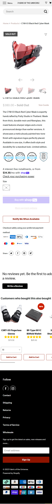
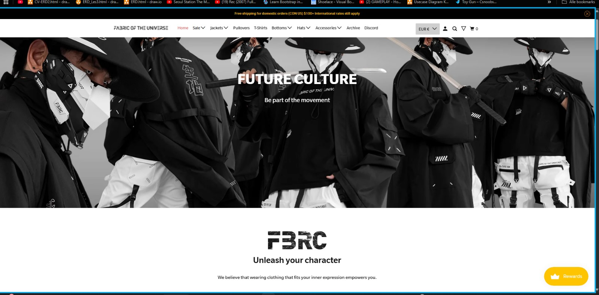
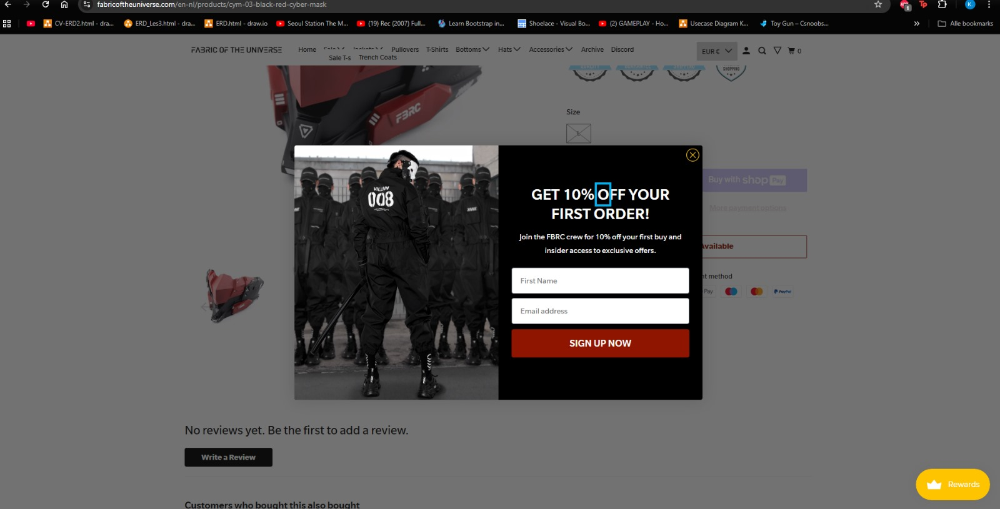
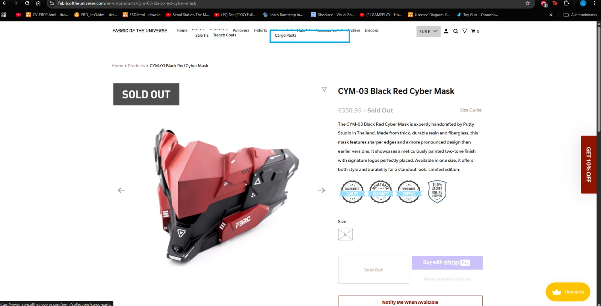
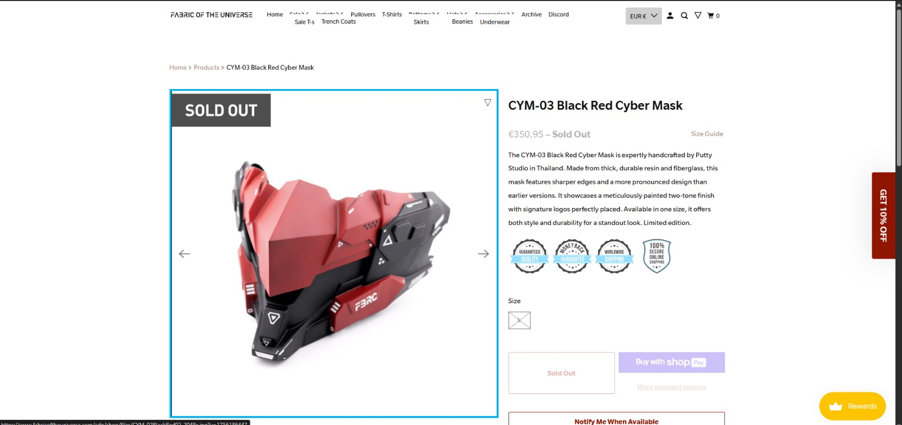
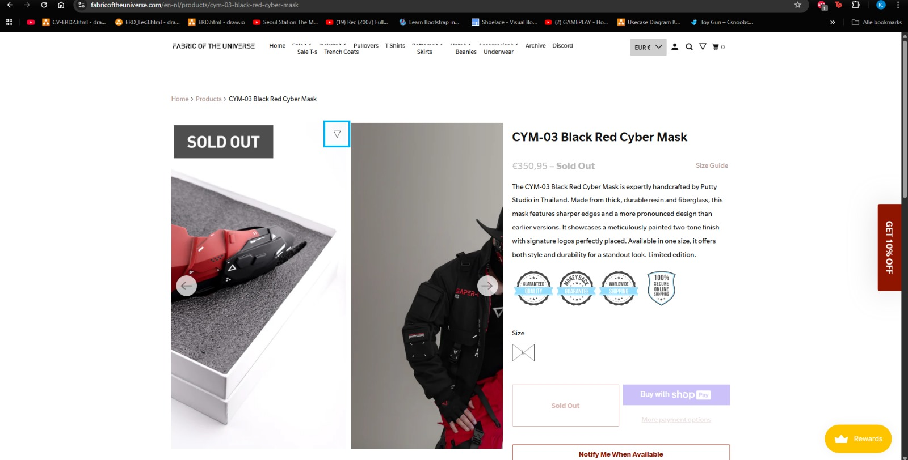
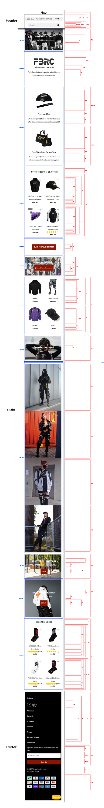
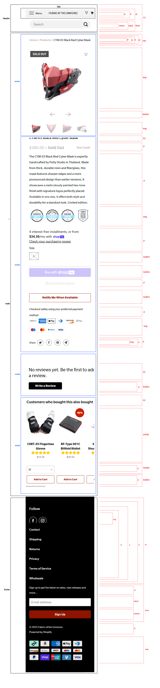

# Procesverslag
Markdown is een simpele manier om HTML te schrijven.  
Markdown cheat cheet: [Hulp bij het schrijven van Markdown](https://github.com/adam-p/markdown-here/wiki/Markdown-Cheatsheet).

Nb. De standaardstructuur en de spartaanse opmaak van de README.md zijn helemaal prima. Het gaat om de inhoud van je procesverslag. Besteedt de tijd voor pracht en praal aan je website.

Nb. Door *open* toe te voegen aan een *details* element kun je deze standaard open zetten. Fijn om dat steeds voor de relevante stuk(ken) te doen.

## Jij

  
uitwerken voor kick-off werkgroep

  ### Auteur:
  Kevin Yip

  #### Je startniveau:
  Blauw

  #### Je focus:
  Surface plane
 

## Je website

  
uitwerken voor kick-off werkgroep

  ### Je opdracht:
  https://www.fabricoftheuniverse.com/en-nl 

  #### Screenshot(s) van de eerste pagina (small screen) Homepagina : 

  

  #### Screenshot(s) van de tweede pagina (small screen) Product pagina :

  

De pagina's worden met een breedte van 390px nagemaakt.

## Toegankelijkheidstest 1/2 (week 1)

  
uitwerken na test in 2e werkgroep

  ### Bevindingen
  Lijst met je bevindingen die in de test naar voren kwamen:

  1.Het aanzetten van de Narrator op Windows met specifieke toetscombinaties is nog zeer ingewikkeld om te gebruiken, vooral omdat wij gewend zijn om het niet te gebruiken. 
  
  2.Het is verwarrend om de Narrator te bedienen want het kan alleen het scherm per heading lezen of per link lezen maar niet voor paragrafen.

  3.Voor het lezen van de headings is het geen probleem, alleen kan de screenreader geen parragrafen (in dit geval de beschrijving van de kopjes) voorlezen.

  4.Voor het lezen van productafbeeldingen werkt het perfect, de afbeeldingen zijn voorzien van de volledige naam van het product, alleen staat het er wel 2 keer in verwerkt en leest de screenreader het 2 keer voor.

  5.Voor het lezen van andere producten worden beoordelingen van een product niet volledig en duidelijk voorgelezen door de screenreader, alleen de aantal reviews.

  6.Bij het laden van de pagina wordt de omschrijving van de webshop voorgelezen.
  
  

  7.Bij het laden van een productpagina wordt de omschrijving direct voorgelezen.

  8. Bij pop-ups worden de headers direct ook voorgelezen.
     
  
  
  9. Bij de navigatie kan je met de screenreader zelfs elke dropdown item nagaan.
      
  

  10. Bij de iconen alhoewel wordt de winkelwagen niet correct voorgelezen, alleen "o".

  11. Het plaatje van het product is wel te lezen door de screen-reader als een klikbare link maar de pijltjes om door de verschillende afbeeldingen heen te navigeren worden niet opgepikt als link.
      
  

  12. Om het uit te proberen, heb ik met "j" de knoppen genavigeert, hier kan ik wel "soort van" bij de andere plaatjes komen. Ik ben wel tegen het probleem aangelopen dat mijn narrator vast staat bij de "add to wishlist" icoon. Als ik verder navigeer naar de volgende knop wordt er steeds op de "add to wishlist" knop geklikt en de plaatje verschuift steeds halfverwege door.
  
  

## Breakdownschets (week 1)

  
uitwerken na afloop 3e werkgroep

  ### Home pagina: 
  

  ### Product pagina): 
  

## Voortgang 1 (week 2)

  
uitwerken voor 1e voortgang

  ### Stand van zaken
  hier dit ging goed & dit was lastig (neem ook screenshots op van delen van je website en code)
  Ik zat vooral vast met de navigatie en de eerste sectie. Ik kon de navigatie maar niet tevoorschijn laten komen zoals het in de opdracht beschreven was. verder wilde ik aan niets anders beginnen sinds de navigatie opzich zelf een belangrijke en element is die al best   moeilijk is om na te maken. 
  Naast wat hulp vragen aan de studenten assistent en natuurlijk chatGPT had ik het eindelijk kunnen oplossen en het aan de praat te krijgen. Ik was toen direct verder gegaan met de volgende secties van mijn website. Hier had ik veel minder moeite mee sinds het in de     meeste gevallen secties zijn die meerdere keren worden gebruikt, dus de code hoefde ik maar 1 keer te schrijven met wat aanpassingen hier en daar. Ik ben nu nog bezig met de footer, meer op de nadruk van het importeren van alle icoontjes van de betaalmethodes. Verder   is mijn website natuurlijk niet exact hetzelfde, het komt heel erg overeen met wat missende elementen hier en daar, maar dat hou ik voor later als ik tijd over heb.

  Dingen waarover ik graag wil weten zijn: Het maken van een carousel, een pop-up balk onder de navigatie die je kan wegklikken, een pop-up melding die tevoorschijn komt als ik op de webpagina ben, een knop aan de zijkant van het scherm die altijd meescrollt zonder       elementen te verschuiven, en het plaatsen van svg iconen.

  ### Agenda voor meeting
  samen met je groepje opstellen

  | student 1      | student 2          | student 3    | student 4        |
  | Amber          | ---                | ---          | ---              |
  |  
  | Hamburgermenu  | en ik dit          | en dan ik dat|
  | Carousel       | dit als er tijd is | nog een punt | dit wil ik zeker |
  | ...            | ...                | ...          | ...              |

  ### Verslag van meeting
  hier na afloop snel de uitkomsten van de meeting vastleggen

  - Punt 1: De toegankelijkheidstest is zeer uitgebreid gedaan op bepaalde punten, zoals de screenreader. echter kan het wat meer uitgebreid op andere punten van de WACG checklist.
  - Punt 2 Verder moet ik beter kijken welke secties inderdaad articles bevatten. Articles zijn stukjes code die informatie vertelt, net als een klein stuk tekst met wat afbeeldingen. De product secties zijn dus geen articles dus dat moet aangepast worden.
  - Punt 3: Secties beginnen altijd met een kopje (h2), bij sommige secties zijn dat niet verwerkt. Ik moet dus alle secties nu voorzien van een kopje en indien nodig het onzichtbaar maken met stijlen.
  - Punt 4: Voor het maken van een pop-up is het gebruik van de nieuwe HTML code: Dialogue een optie. Anders met Javascript een onload functie aanmaken.

## Voortgang 2 (week 3)

  
uitwerken voor 2e voortgang

  ### Stand van zaken
  hier dit ging goed & dit was lastig (neem ook screenshots op van delen van je website en code)

  ### Agenda voor meeting
  samen met je groepje opstellen

  | student 1      | student 2          | student 3    | student 4        |
  | ---            | ---                | ---          | ---              |
  | dit bespreken  | en dit             | en ik dit    | en dan ik dat    |
  | en dat ook nog | dit als er tijd is | nog een punt | dit wil ik zeker |
  | ...            | ...                | ...          | ...              |

  ### Verslag van meeting
  hier na afloop snel de uitkomsten van de meeting vastleggen

  - punt 1
  - punt 2
  - nog een punt
- ...

## Toegankelijkheidstest 2/2 (week 4)

  
uitwerken na test in 9e werkgroep

  ### Bevindingen
  Lijst met je bevindingen die in de test naar voren kwamen (geef ook aan wat er verbeterd is):

## Voortgang 3 (week 4)

  
uitwerken voor 3e voortgang

  ### Stand van zaken
  hier dit ging goed & dit was lastig (neem ook screenshots op van delen van je website en code)

  ### Agenda voor meeting
  samen met je groepje opstellen

  | student 1      | student 2          | student 3    | student 4        |
  | ---            | ---                | ---          | ---              |
  | dit bespreken  | en dit             | en ik dit    | en dan ik dat    |
  | en dat ook nog | dit als er tijd is | nog een punt | dit wil ik zeker |
  | ...            | ...                | ...          | ...              |

  ### Verslag van meeting
  hier na afloop snel de uitkomsten van de meeting vastleggen

  - punt 1
  - punt 2
  - nog een punt
  - ...

## Eindgesprek (week 5)

  
uitwerken voor eindgesprek

  ### Je uitkomst - karakteristiek screenshots:
  

  ### Dit ging goed/Heb ik geleerd: 
  Korte omschrijving met plaatjes

  

  ### Dit was lastig/Is niet gelukt:
  Korte omschrijving met plaatjes

  

## Bronnenlijst

  
continu bijhouden terwijl je werkt

  Nb. Wees specifiek ('css-tricks' als bron is bijv. niet specifiek genoeg). 
  Nb. ChatGpT en andere AI horen er ook bij.
  Nb. Vermeld de bronnen ook in je code.

  1. bron 1
  2. bron 2
  3. ...

